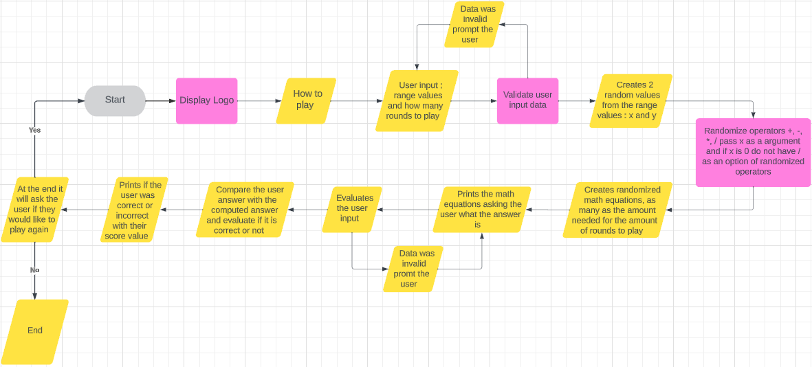
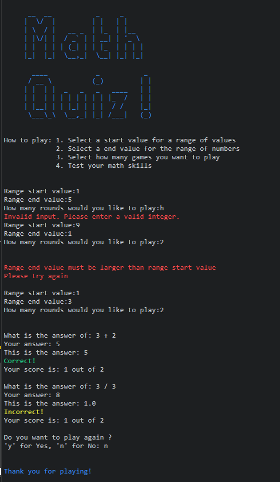
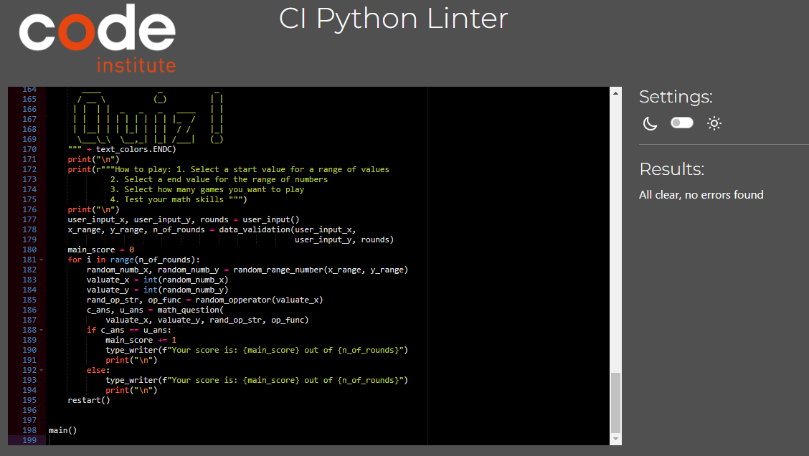

# Maths Quiz

This is a WebApp to improve your math skills

## [Click here to view website](https://maths-quiz-08c6a5ff7616.herokuapp.com/)

# How to play

1. Select a start value for a range of values
2. Select a end value for the range of numbers
3. Select how many games you want to play
4. Test your math skills

# UX

## User Stories

- First-time visitor

  - Clear instructions of how to play the game
  - Try the game and have a feel for the experience
  - See the score of how well the user did

- Returning visitor

  - Returning visitor will want to practice their math skills
  - Share the app with their peers

- Frequent user

  - Will be challenging themselves with more difficult range values 
  - Will see if they can beat there own high score and challenge their peers
  - Will be wanting updates and improvements to the app 

## Strategy

This game was created with the intent to catch the attention of anyone who comes across this game.
The targeted audience of this game is to everyone and all ages looking to improve their math skills that has some time to pass whether it is a quick lunch break or a breather just wanting to challenge themselves.
It is a simple game and easily understandable

## Scope

The Game will:
- Accept user input
- Create a random math equations
- Ask the user what the answer is to the equation
- Evaluate if the answer is correct
- Increment the score if the answer was correct
- After the rounds are complete prompt the user if they would like to play again

## Structure

The game will be structured with user experience in mind, it will have simple user prompts and guidance

## Flow chart

This is a flow chart about the logic of the WebApp

## Color pallet of the App

- The logo of the WebApp is Blue
- Any invalid input will be display a error in red
- If the answer is correct it will display the word “Correct” in green
- If the answer is incorrect it will display the word “Incorrect” in yellow
- If you do not want to play again it will display “Thank you for playing!” in blue.

# Features

## Existing Features

- The logo has a typewriter effect
- The score has a typewriter effect
- The "Do you want to play gain" has a typewriter effect
- The WebApp is designed to prevent any unwanted input from the user that is not required and will prompt them to enter a valid input
- The WebApp will randomize math equations for the user as many as the amount of rounds the user wants to play
- The math equations will be in the format of “y operator x”
- Every random equation that is created the “x” value is evaluated first if x is 0 it will remove the option divide “/” from the random operators so you can not get a math equation that will divide by 0 for example “2 / 0”

## Future Features

Add a signup where there will be set range values with a timer to answer to answer the math equations that will display your score on a scoreboard so you can challenge your peers 

# Testing

## Known Bugs

A bug to me that I would like to work on is that it will ask the user range values and if the first value is larger than the second it will continue to ask how many rounds you would like to play, then evaluate the input of the range values only then and if it was incorrectly entered it will prompt you only then to try again with a valid input 

I would like it evaluate the range values first then only ask how many rounds you would like to play

The reason for this is that I only at a later stage thought it would be a good idea for the user to choose how many rounds they would like to play and had to change the functions to best suit this

I am thinking of ways how to restructure the functions to do this evaluation in this order

## Fixed Bugs

Creating the WebbApp I encountered a bug, the score would increment only once and not again there after 
This would happen everytime a new equation was created 

I have come to a conclusion this happens because the function to increment the score was in the loop of creating new math equations and that the loop will reset the score every time the loop would run 

The solution i had for this is to loop some of the functions in the main function and let the score count be stored in a variable in the main function outside of the loop, that way the score would be accurately incremented

## Manual Testing

| What was tested | Result | Outcome |
|:---:|:---:|:---:|
|Passed it a alphabetical value|Invalid input error|Works as intended|
|Range start value highers than range end value|Prompt the user to enter a smaller start value than a end value|Works as intended|
|Answer correct|Evaluation was correct and displayed in green "Correct!"|Works as intended|
|Answer incorrect|Evaluation was correct and displayed in yellow "Incorrect!"|Works as intended|
|Score|Increments when user gives the correct answer|Works as intended|
|Do you want to play again|It restarts the game or ends it|Works as intended|
|Range values|Gets random numbers from the range values|Works as intended|
|Random operators|Gets random operators dependent on the value of "x"|Works as intended|

## Validator Testing

I used the CI Python Linter as a validator to validate the code and it is error free

# Deployment

1. Login to Heroku
2. On the Heroku dashboard click on 'New'
3. Select 'Create New App'
4. Add an app name (Must be a unique name) and select your region
5. Click 'Create App'
6. On the next page at the top click 'Settings' then 'Config Vars'
7. Click 'Reveal Config Vars' then add 'Port' key and value '8000' (Optional if you have private documentation)
8. Scroll down and click 'Buildpack'
9. 'Add', 'Python' & 'Node.js' with Python being first (above) Node.js
10. At the top of the page again, click 'Deploy'
11. Click on 'Github' as your deployment method
12. Search the relevant repo and link these
13. Once linked, select 'Automatic deploys from' or 'Manual Deploy'
14. The app will now be hosted on Heroku.

- ## _Cloning the GitHub repository_

This will download a full copy to your desktop

1. Log into GitHub
2. Find the repository you wish to clone
3. Find the green code button top right corner
4. Select "Local", copy the HTTPS URL
5. Go to Codeanywhere and navigate to "New Workspace"
6. Paste the URL into the space provided
7. Click "Create"

- ## _Forking the GitHub repository_

Will allow you to create a copy of the repository so changes can be made that will not affect the original repository.

1. Log into GitHub
2. Find the repository you wish to fork
3. Find the "Fork" drop down in the top right corner second from last
4. Select "Create"  

# Technologies Used

- [Codeanywhere](https://app.codeanywhere.com/) to write the code
- [Python](https://en.wikipedia.org/wiki/Python_(programming_language)) main language used
- [Git](https://git-scm.com/) Version control
- [Github](https://github.com/) storing files online and for deployment
- [Heroku](https://www.heroku.com/) to deploy the WebApp
- [CI Python Linter](https://pep8ci.herokuapp.com/) Validate the code
- [amiresponsive](https://ui.dev/amiresponsive) to check responsiveness
- [patorjk](https://patorjk.com/software/taag/#p=display&h=0&v=0&f=Big&t=Type%20Something%20) for logo
- [lucidchart](https://www.lucidchart.com/pages/) to create flow chart
- [Snipping Tool](https://freesnippingtool.com/download) to create sniped images

# Credits

- Code Institute for the learning content provided
- Harry Dhillon my assigned mentor to give advise on the project
- Nicole Jackson my wife a student at code institute for constructive criticism
- Slack community
- [stackoverflow](https://stackoverflow.com/questions/26260950/how-can-i-randomly-choose-a-maths-operator-and-ask-recurring-maths-questions-wit ) guidence of project 
- [w3schools](https://www.w3schools.com/python/trypython.asp?filename=demo_ref_random_randint) How "randit" works to create random values between a range of values
- [101computing](https://www.101computing.net/python-typing-text-effect/) how to create typewriter effect
- [stackoverflow](https://freesnippingtool.com/download) how to create color text to improve UX

