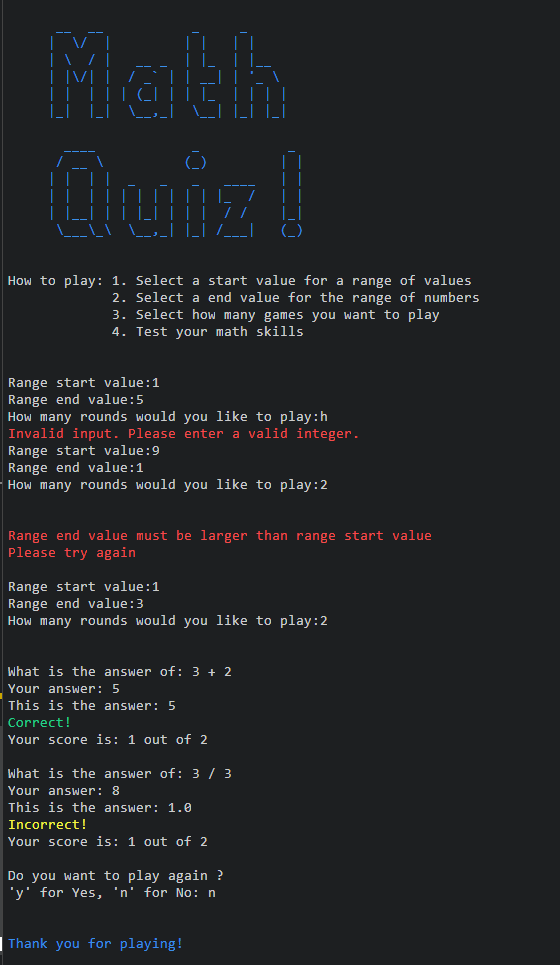

# Maths Quiz
This is a WebApp to improve your math skills

## [Click here to view website](https://maths-quiz-08c6a5ff7616.herokuapp.com/)

# How to play
1. Select a start value for a range of values
2. Select a end value for the range of numbers
3. Select how many games you want to play
4. Test your math skills

# UX

# User Stories

- First-time visitor

- Returning visitor

- Frequent user

## Strategy
This game was created with the intent to catch the attention of anyone who comes across this game.
The targeted audience of this game is to everyone and all ages looking to improve their math skills that has some time to pass whether it is a quick lunch break or a breather just wanting to challenge themselves.
It is a simple game and easily understandable

## Scope
The Game will:
- Accept user input
- Create a random math equations
- Ask the user what the answer is to the equation
- Evaluate if the answer is correct
- Increment the score if the answer was correct
- after the rounds are complete prompt the user if they would like to play again

## Structure
The game will be structured with user experience in mind, it will have simple user prompts and guidance

## Flow chart
This is a flow chart about the logic of the WebApp

## Color pallet of the App
- The logo of the WebApp is Blue
- Any invalid input will be display a error in red
- If the answer is correct it will display the word “Correct” in green
- If the answer is incorrect it will display the word “Incorrect” in yellow
- If you do not want to play again it will display “Thank you for playing!” in blue.

# Features

## Existing Features
- The logo has a typewriter effect
- The score has a typewriter effect
- The "Do you want to play gain" has a typewriter effect
- The WebApp is designed to prevent any unwanted input from the user that is not required and will prompt them to enter a valid input
- The WebApp will randomize math equations for the user as many as the amount of rounds the user wants to play
- The math equations will be in the format of “y operator x”
- Every random equation that is created the “x” value is evaluated first if x is 0 it will remove the option divide “/” from the random operators so you can not get a math equation that will divide by 0 for example “2 / 0”

## Future Features
Add a signup where there will be set range values with a timer to answer to answer the math equations that will display your score on a scoreboard so you can challenge your peers 

# Testing

## Known Bugs

## Fixed Bugs

## Manual Testing

| What was tested | Result | Outcome |
|:---:|:---:|:---:|
|Passed it a alphabetical value|Invalid input error|Works as intended|
|Range start value highers than range end value|Prompt the user to enter a smaller start value than a end value|Works as intended|
|Answer correct|Evaluation was correct and displayed in green "Correct!"|Works as intended|
|Answer incorrect|Evaluation was correct and displayed in yellow "Incorrect!"|Works as intended|
|Score|Increments when user gives the correct answer|Works as intended|
|Do you want to play again|It restarts the game or ends it|Works as intended|
|Range values|Gets random numbers from the range values|Works as intended|
|Random operators|Gets random operators dependent on the value of "x"|Works as intended|

## Validator Testing

# Deployment

# Technologies Used

## Frameworks, Libraries

# Credits

## Content

## Media

