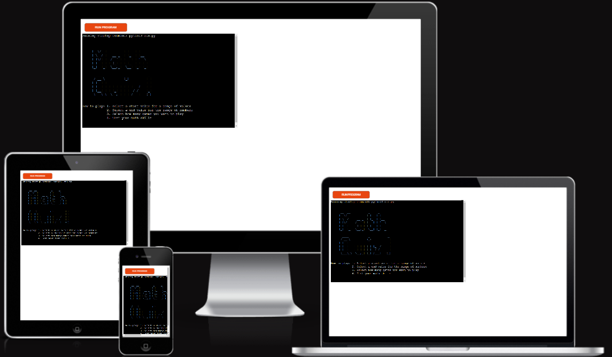
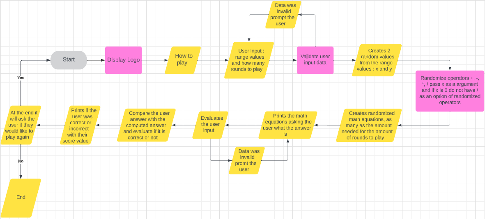

# Maths Quiz
This is a WebApp to improve your math skills
## [Click here to view website](https://maths-quiz-08c6a5ff7616.herokuapp.com/)

# How to play
1. Select a start value for a range of values
2. Select a end value for the range of numbers
3. Select how many games you want to play
4. Test your math skills

# UX

# User Stories

- First-time visitor

- Returning visitor

- Frequent user

## Strategy
This game was created with the intent to catch the attention of anyone who comes across this game.
The targeted audience of this game is to everyone and all ages looking to improve their math skills that has some time to pass whether it is a quick lunch break or a breather just wanting to challenge themselves.
It is a simple game and easily understandable

## Scope
The Game will:

- Accept user input
- Create a random math equations
- Ask the user what the answer is to the equation
- Evaluate if the answer is correct
- Increment the score if the answer was correct
- after the rounds are complete prompt the user if they would like to play again 

## Structure
The game will be structured with user experience in mind, it will have simple user prompts and guidance

## Flow chart 
This is a flow chart about the logic of the WebApp

## Color pallet of the App
The logo of the WebApp is Blue
Any invalid input will be display a error in red
If the answer is correct it will display the word “Correct” in green
If the answer is incorrect it will display the word “Incorrect” in yellow
If you do not want to play again it will display “Thank you for playing!” in blue.

# Features

## Existing Features

## Future Features

# Responsiveness

# Testing

## Known Bugs

## Fixed Bugs

## Manual Testing

| What was tested | Result | Outcome |
|:---:|:---:|:---:|
|...|...|...|

## Validator Testing

# Deployment

# Technologies Used

## Frameworks, Libraries

# Credits

## Content

## Media

